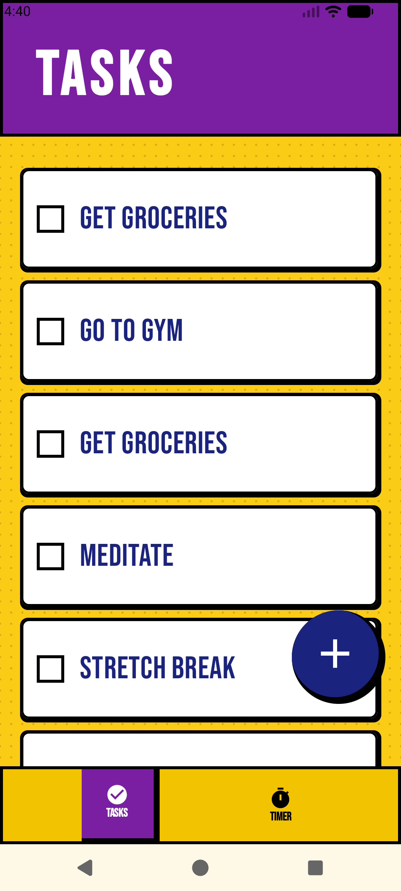
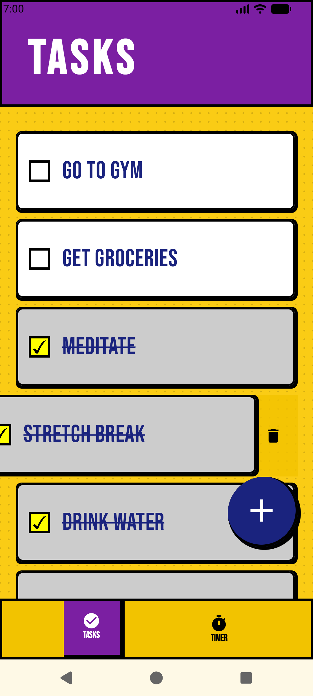
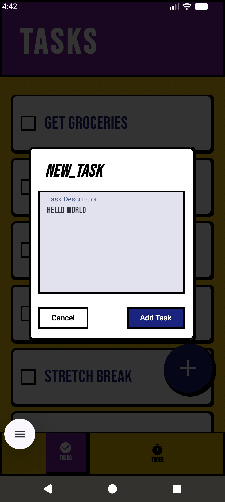
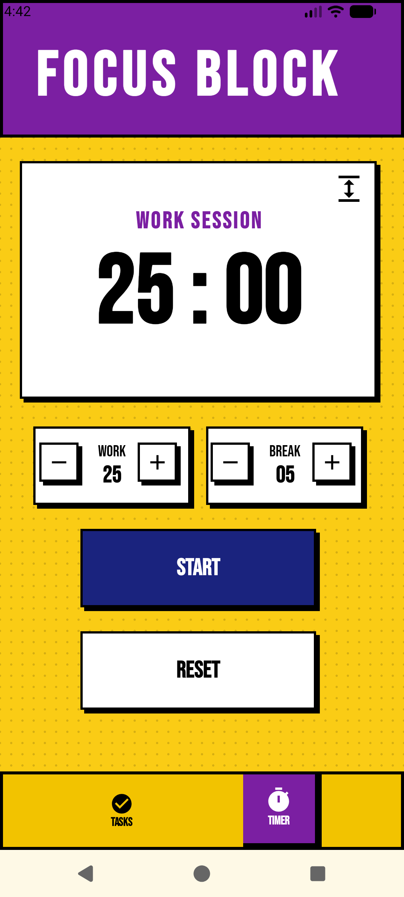
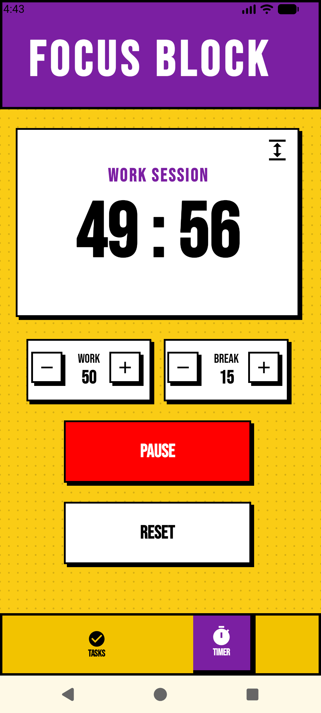
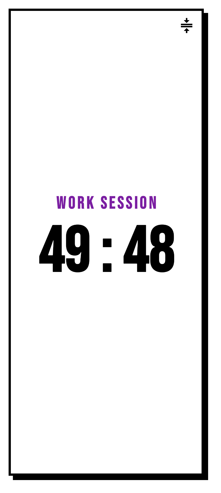

# Tascade

### *Plan Tasks. Stay Focused. Get Things Done.*

Tascade is a modern Android productivity app that combines a powerful **task manager** with a built-in **Pomodoro timer** to help you stay organized, focused, and consistent throughout your day.

Designed with a bold **neo-brutalist aesthetic** and built entirely using modern Android development tools, Tascade delivers a fast, smooth, and distraction-free productivity experience.

✅ Manage daily tasks  
⏳ Track focus sessions  
🔥 Build productive habits  
📱 Enjoy a clean and responsive UI  

All in one sleek productivity app.

## 📸 Screenshots

<p align="center">
  
  
  
  
  
  
</p>

## 🛠 Tech Stack & Architecture

- **Kotlin** + **Jetpack Compose**   
 with Material 3
- **MVVM + UDF** architecture for scalable state management
- **Coroutines & StateFlow** for reactive UI updates
- **Room Database** with Repository Pattern for offline-first storage
- **Retrofit2** + **Gson/Kotlin Serialization** for API integration
- **Navigation Compose** with optimized back-stack handling
- Advanced **Compose Animations** for smooth interactions

## 📥 Installation

### For Users
1. Go to the **Releases** section of this repository  
2. Download the latest `.apk` file  
3. Install it on your Android device  

> You may need to enable **"Install unknown apps"** in your device settings.

### For Developers
```bash
git clone https://github.com/yourusername/tascade.git
```

1. Open the project in **Android Studio**
2. Allow Gradle to sync and download the necessary dependencies. 
3. Select an Android Emulator or connect a physical Android device via USB debugging. 
4. Click the green Run button (Shift + F10) to compile and install the app.

## 🏗️ Project Structure

```text
app/
├── manifests/
├── kotlin+java/com.example.tascade/
│
├── data/
│   ├── OfflineTodoRepository
│   ├── TimerDataStore.kt
│   ├── TodoDao
│   ├── TodoDatabase
│   └── TodoRepository
│
├── model/
│
├── navigation/
│   ├── TascadeDestinations.kt
│   └── TascadeNavGraph.kt
│
├── ui/
│   ├── components/
│   ├── pomodoro/
│   │   ├── components/
│   │   │   ├── ActionButtons.kt
│   │   │   ├── AdjusterButtons.kt
│   │   │   ├── FullScreenMode.kt
│   │   │   ├── PomodoroBoard.kt
│   │   │   └── TimeAdjusterBlock.kt
│   │   └── PomodoroScreen.kt
│   │
│   ├── theme/
│   │
│   └── todo/
│       ├── components/
│       └── TodoScreen.kt
│
├── util/
├── MainActivity
├── PomodoroViewModel
├── TodoViewModel
│
├── res/
│   ├── drawable/
│   ├── font/
│   ├── mipmap/
│   ├── raw/
│   ├── values/
│   └── xml/
│
└── Gradle Scripts
```

## 🚀 Usage

- Create, edit, and delete tasks effortlessly
- Organize your workflow with a clean and responsive UI
- Use the built-in **Pomodoro Timer** to stay focused
- Enable focus mode to reduce distractions during work sessions
- All data is stored locally for a fast, offline-first experience

## ✨ Key Features

* **Smart App-Blocking Timer:** A Pomodoro focus timer that syncs with a backend REST API via Retrofit to automatically restrict distracting apps on your device during active sessions.
* **Offline-First Task Tracker:** Create, update, and manage your daily to-dos instantly using a local Room database that works flawlessly without an internet connection.
* **Tactile Custom UI:** A highly polished, custom bottom navigation bar that leverages Jetpack Compose `AnimatedContent` for fluid, reactive screen transitions.


