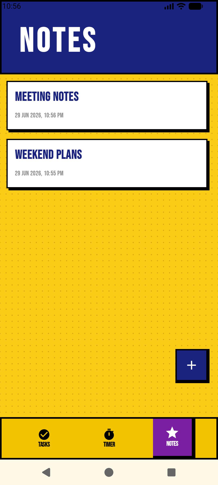
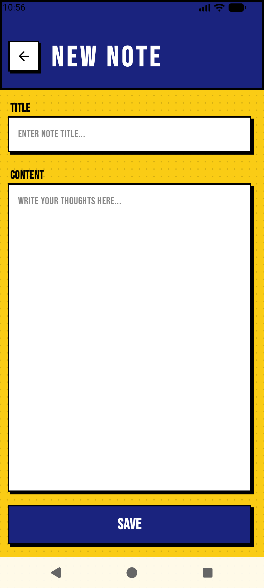
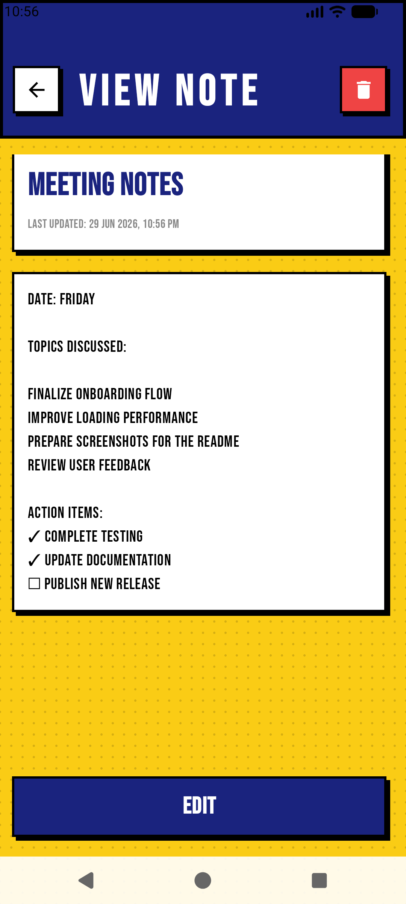

# Tascade

### *Plan Tasks. Stay Focused. Capture Ideas. Get Things Done.*

Tascade is a modern Android productivity app that combines a powerful **task manager**, a built-in **Pomodoro timer**, and a dedicated **notes manager** to help you stay organized, focused, and consistent throughout your day.

Designed with a bold **neo-brutalist aesthetic** and built entirely using modern Android development tools, Tascade delivers a fast, smooth, and distraction-free productivity experience.

✅ Manage daily tasks  
⏳ Track focus sessions  
📝 Capture and edit quick notes  
🔥 Build productive habits  
📱 Enjoy a clean and responsive UI  

All in one sleek productivity app.

## 📸 Screenshots

<p align="center">
  
  
  
  
  
  
  
  
  
</p>

## 🛠 Tech Stack & Architecture

- **Kotlin** + **Jetpack Compose** with Material 3
- **MVVM + UDF** architecture for scalable state management
- **Coroutines & StateFlow** for reactive UI updates
- **Room Database** with Repository Pattern for offline-first storage of tasks and notes
- **DataStore** for efficient local preference and timer state saving
- **Navigation Compose** with optimized back-stack handling
- Advanced **Compose Animations** for smooth interactions

## 📥 Installation

### For Users
1. Go to the **Releases** section of this repository  
2. Download the latest `.apk` file  
3. Install it on your Android device  

> You may need to enable **"Install unknown apps"** in your device settings.

### For Developers
```bash
git clone [https://github.com/VISP06/Tascade_To-do-App.git](https://github.com/VISP06/Tascade_To-do-App.git)
```

1. Open the project in **Android Studio**
2. Allow Gradle to sync and download the necessary dependencies. 
3. Select an Android Emulator or connect a physical Android device via USB debugging. 
4. Click the green Run button (Shift + F10) to compile and install the app.

## 🏗️ Project Structure

```text
app/
├── manifests/
├── kotlin+java/com.example.tascade/
│
├── data/
│   ├── TimerDataStore.kt
│   ├── TodoDatabase / TodoDao / TodoRepository
│   └── NoteDatabase / NoteDao / NoteRepository
│
├── model/
│
├── navigation/
│   ├── TascadeDestinations.kt
│   └── TascadeNavGraph.kt
│
├── ui/
│   ├── components/
│   ├── notes/
│   │   ├── NoteDetailScreen.kt
│   │   ├── NoteEditScreen.kt
│   │   └── NotesListScreen.kt
│   │
│   ├── pomodoro/
│   │   ├── components/
│   │   └── PomodoroScreen.kt
│   │
│   ├── theme/
│   │
│   └── todo/
│       ├── components/
│       └── TodoScreen.kt
│
├── util/
├── MainActivity
├── PomodoroViewModel
├── TodoViewModel
├── NotesViewModel
│
├── res/
└── Gradle Scripts
```

## 📊 Usage

- **Tasks:** Create, edit, and delete daily tasks effortlessly.
- **Notes:** Quickly draft, read, and edit longer-form ideas in a dedicated workspace.
- **Focus:** Use the built-in Pomodoro Timer to maintain deep work sessions.
- **Offline Reliability:** All data is stored locally for a fast, offline-first experience.

## ✨ Key Features

* **Built-In Pomodoro Timer:** Stay productive with a clean and distraction-free focus timer designed to help you maintain deep work sessions and build consistent study habits.
* **Offline-First Task & Note Tracking:** Manage your daily to-dos and capture important ideas instantly using a local Room database that works flawlessly without an internet connection.
* **Tactile Custom UI:** A highly polished, custom bottom navigation bar that leverages Jetpack Compose `AnimatedContent` for fluid, reactive screen transitions, fully adhering to a striking neo-brutalist design system.
* **Modern Android Architecture:** Built using MVVM, UDF, StateFlow, and Jetpack Compose to deliver a scalable, maintainable, and responsive app experience.
